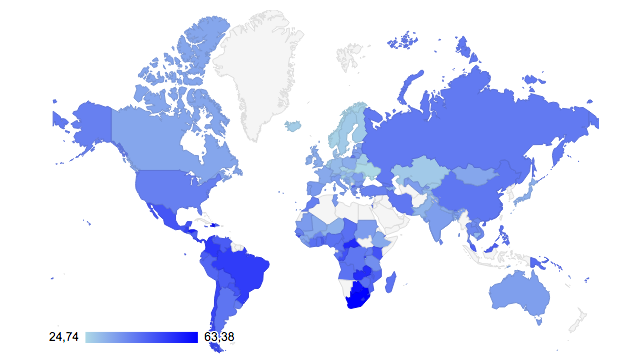
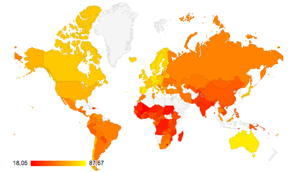

```{r setup, include=FALSE}
knitr::opts_chunk$set(echo = TRUE)
```


```{r commands, include=FALSE}
knitr::opts_chunk$set(echo = FALSE)
library(WDI)
library(countrycode)
library(rio)
library(stargazer)
library(ggplot2)
library(tidyr)
library(plotly)
library(plm)
library(googleVis)
library(lmtest)

possible_dir <- c('C:/RajuPC/CollaborativeSSDA/Assignments/Assignment4', '/Users/mariorodriguez/Desktop/Assignment4')
repmis::set_valid_wd(possible_dir)

Combined <- read.csv('EPIGINI.csv')

Combined2012 <- read.csv('EPIGINI2012.csv')

Combined2010 <- read.csv('EPIGINI2010.csv')

Combined2014 <- read.csv('EPIGINI2014.csv')

Combinedmaps <- read.csv('Maps.csv')

### Changed the maps, now it will give you the latest available value for both Gini and EPI


ax <- list(
  title = "Country",
  zeroline = FALSE,
  showline = FALSE,
  showticklabels = FALSE,
  showgrid = FALSE
)

labels <- c('Gini Coefficient', 'GDP Per Capita (PPP)', '(Intecept)')

m1 <- lm(EPI.2012 ~ GINI, Combined2012)

m2 <- lm(EPI.2012 ~ GINI + log(GDPPerCapPPP), Combined2012)

m3 <- lm(EPIValue ~ GiniCoeff + log(GDPperCapPPP), Combined)

m4 <- lm(EPI ~ Gini + log(GDPperCapPPP) + PopulationDens, Combined2014)
summary(m4)

m5 <- plm(EPI ~ Gini + log(GDPperCapPPP) + PopulationDens, data=Combined2014, index= c('country', 'year'), model = 'within')
summary(m5)

m6 <- plm(EPI ~ Gini + log(GDPperCapPPP) + PopulationDens, data=Combined2014, index= c('country', 'year'), model = 'random')
summary(m6)

bptest(m5) ###It shows that there is heteroscedasticity

### We test the coefficients to control the heteroscedasticity, all of them appear to maintain their statistical significance after the tests (the interpretation is here http://dss.princeton.edu/training/Panel101R.pdf)

coeftest(m5) 

coeftest(m5, vcovHC)

coeftest(m5, vcovHC(m5, method = "arellano"))

coeftest(m5, vcovHC(m5, type = "HC3")) 

### We test for serial correlation (apparently we have serial correlation but I don't know how to control for it - maybe we don't include it)

pbgtest(m5)

#### Plot of simple regression with confidence intervals

ggplot(Combined2012, aes(x=EPI.2012, y=GINI)) +
    geom_point(shape=1) + 
    geom_smooth(method=lm) 


### This shows the mean value for each year, don't know if its of any use for us

aggregate(EPI ~ year, Combined2014, mean)

aggregate(Gini ~ year, Combined2014, mean)


```


# Abstract  

The aim of this paper is to quantitatively analyze the effect of income inequality on the environment. The paper intends to carry out the research using a set of relevant variables that describe inequality and environment performance while controlling for other relevant variables. The aims to research the specific question of whether income inequality of a country affects its Environmental Performance Index (EPI). Various descriptive and inferential statistical methods are used to analyze and estimate the effects. The goal is find policy relevance of the interconnected of the two entities.  

_Key words: Inequality, Environmental Performance Index (EPI)_

# Introduction

Income inequality is one of the biggest issues grappling both developing and developed countries alike. While most development agendas in the past have focused heavily on poverty, it has been clearly established that income inequality is the pressing issue now. The UN Sustainable Development Goals have also put a strong emphasis on income inequality. Increased urbanization and growing reliance on international trade have increased even further the differences between the poor and the rich and through globalization it has become more visible to all. Inequality has been considered the cause of many social, political and economic crisis around the world. Plethora of research on inequality show that it affects education, healthcare [@lynch2000income], the economy, and even voter turnout and elections in many countries. However, the focus of our research won't further explore any of these social or political issues. We aim to research the effect of inequality on the environment. We find this interesting because climate change is one of the biggest threats that our generation is facing, but it is very much disconnected with other social and economic issues that scholars usually talk about. Showing a relationship between inequality and environment can be extremely important to create a better roadmap for development, since policymakers may find better approaches to solve these issues if they are found to be somehow correlated.  

## Inequality: 

According to the IMF [@dabla2015causes], the gap between the rich and the poor is at its highest in decades. The organization argues that inequality could be a sign of lack of income mobility and opportunity. Furthermore, it has significant implications for growth and macroeconomic stability, it can concentrate political and decision making power in few hands, lead to a suboptimal use of human resources, cause investment-reducing political and economic instability and increase the risk of crisis.  

The most widely used estimator for inequality is the GINI coefficient. Developed in 1912, by Italian statistician Corrado Gini, it is a way of comparing how distribution income in a country compares with another in which everybody earned the same amount. Inequality on the Gini scale is measured between 0, where everybody is equal, and 100, where all the income is earned by one person. Despite some criticism about some inaccuracies [@bbcnews_2015] on certain percentages of the population, the index is still the golden standard for measuring inequality in societies. 

## Environment:  
   
Scholars believe that climate change represents the most globalized impact of humanity on nature and something that has the potential to infuse great suffering to the current and the future generation [@lever2010routledge]. Heavy industrial work and rapid globalization has increased the impact on environment at a very rapid level. Many cities in China and India are filled with smog, while many island nations face constant environmental hazards perpetrated by climate change. Since most of the turmoil seen in the environment is related to anthropogenic activities, the measures to control must start from the people. Change in production and consumption habits and a reduction in emission of greenhouse gases have been at the forefront of policy agendas for decades now. However, there has been a real challenge in quantifying the effect on the environment so it can be fit in economic development models. Many scholars have presented various viewpoints on how the issue of climate change can be dealt with but the one that stands out the most in by Elanor Ostrom. Her solution to protecting the common pool resources is my strong institutions circled around the people [@ostrom2015governing]. But then the question that rises is are people in all economic situation equally motivated to care about the environment. We will be analyzing that further in the paper.  

Environment Performance Index: The Environmental Performance Index (EPI) is an indicator that seeks to quantify the environmental performance of a state's policies. The precursor to this metric was the Pilot Environmental Performance Index, first released in 2002 and designed to supplement the environmental targets in the United Nations Millennium Development Goals. The EPI is developed by the Yale Center for Environmental Law & Policy and ranks countries' performance in two areas: protection of human health and protection of ecosystems. The Index scores national performance in nine issue areas comprised of more than 20 indicators. Here is a table with the basic information about the framework of the indicator.  

|Environmental Health(50%) | Ecosystem Vitality(50%)        |
|------------------------- | -------------------------------|
|Health impacts(33%)       | Water Resources (25%)          |
|Air Quality(33%)          | Agriculture (10%)              |
|Water and Sanitation (33%)| Forests (10%)                  |
|                          | Fisheries (5%)                 |
|                          | Biodiversity and Habitat (25%) |
|                          | Climate and energy (25%)       |

In its 15th year, the EPI report for 2016 was launched at the World Economic Forum. The organizers declared that the Index is more relevant than ever to achieving the United Nations' Sustainable Development Goals and carrying out the Paris Agreement.

# Literature Review: Interconnectedness between Inequality and Environment

A few scholars have already connected the dots and analyzed the relationship between inequality and environment. Nobel Laureate Joseph E. Stiglitz argues that inequality can contribute to environmental degradation because the poor tend to have less interest in pursuing policies designed to protect the environment and therefore good environment policies will be less supported [@conca2014green]. He also argues that the relationship goes both ways in the sense that good environmental policies will help build social cohesion and reduce inequality [@conca2014green]. J. Timmons Roberts believes that global warming is all about inequality based on who created it and who suffers from it the most [@roberts2001global]. Nazrul Islam, a Senior Economic Affairs Officer at the Development Policy Analysis Division of UN DESA provides an analytical framework to explain negative correlations between inequality and quality of environment and suggests that reducing inequality will help protect the environment [@nazrul2015inequality]. He adds that gender inequality is another dimension that affects environment thus providing us even more reason to examine this case [@nazrul2015inequality]. Wilkinson and Pickett argue that equal societies are better in terms of social cohesion and public spiritedness, which they link to being fundamental in responding to environmental issues [@wilkinson2011spirit]. They show statistically that more equal countries recycle a higher proportion of their waste, a clear indication of how inequality affects the environment [@wilkinson2011spirit].  Sternreview report asserts that climate change is an externality whose cause and consequence both involves deep inequalities [@stern2007economics]. Several other scholars have vigorously analyzed environment and human security [@barnett2007climate], climate change in poor and unequal countries [@gordon2007climate], inequality and resource management [@Baland1999773], inequality and environmental sustainability [@baland2007inequality], and inequality as a cause of environmental degradation [@BOYCE1994169] - all of which provide ample theoretical basis to continue this research.

# Methodology

We have used quantitative analysis using R programming to test the hypothesis. The descriptive and inferential statistical measures used in the paper are showcased using regression tables, plots, graphs and maps, all of which are made using R. The results obtained from quantitative analysis is meticulously coupled with qualitative literature review that consisted of scholarly articles and reports by experts of the fields. We have analyzed scholarly sources that have influenced the discussion on the relationship between inequality and environment. 

To do a statistical analysis of the issue, it is extremely important to locate data sources. The World Bank Database has most of the indicators necessary to do a thorough analysis of the topic. Some of the indicators used to carry out the research were: Gini Coefficient, Environment Performance Index, GDP per Capita Purchasing Power Parity, and Population Density. The data was extracted from the World Bank API, and Yale Center for Environmental Law & Policy website. Since the data were obtained from multiple sources, they had to be cleaned and merged, which resulted in a panel dataset from years 2002 to 2014. Year-specific data was used to draw several maps and plots. However, for the inferential analysis using regression, the entire panel data with all the relevant dependent, independent, and control variables were used.  

# Operationalization

*Dependent Variable:* The dependent variable for our research is Environment Performance Index, written as _EPI_. Our data frame consists of EPI for 232 countries from 2002-2014. It is provided by the Yale Center for Environmental Law & Policy. The EPI scores from 2002 to 2012 were measured using historical. These scores differ from the previous 2012, 2010, 2008  and  2010 scores due to changes in raw data sources, differences in methodologies, changes to targets and weightings. These were designed as a time series to show what a country's EPI score would have been in a prior year, given the 2014 EPI's method, framework, and target scores. The value of all EPI scores range from 0 to 100. Higher the EPI value, the better a country performs environmentally. Although we do have EPI for 2016, we have decided to omit that year since we do not the data for other variables after 2014.

*Explanatory Variable:* The main independent (explanatory) variable used for our research is the Gini coefficient, written as _Gini_. Our data frame consists of Gini for 138 countries from 2002-2014. Since, Gini is not measured every year by the respective countries, data for some of the years are missing.

*Control Variables:* The first control variable is GDP per capita (PPP). It is written as _GDPperCapPPP_. Our data frame consists of GDP per Capita (PPP) from 2002-2014 and it was obtained from the World Bank API and merged into the data frame that consisted EPI and Gini. We decided to utilize the Log of GDP, given that it changes multiplicatively than additively, so analysis on logarithmic scale is helpful. Purchasing power has been established as one of the main dimensions of power that affect social decisions on environment protection [@boyce2003inequality]. The second control variable is Population Density and it is written as _PopulationDens_. Our data frame consists of Population Density from 2002-2014 and it was obtained from the World Bank API and merged into the data frame that consisted EPI and Gini. Population-environment theories suggest that higher population density can have negative impact on the environment due to land degradation, water use, etc. [@de2007population]. Moreover, the correlation between population density and inequality justifies the use of the control variable [@wheeler2004wage].      

*Research Question:* Our research question is "Does income inequality affect the environment performance index?" Through this question, we are planning on analyzing the relationship between inequality and environment so that we can better understand the policy implication of these highly relevant areas.

*Regression Equation:* The regression equation is written as follows:  
            $EPI = \beta_0 + \beta_1(Gini) + \beta_2 log(GDPperCapPPP) + \beta_3(PopulationDens) + \epsilon$


# Descriptive Analysis  



As we can see in the Gini Map, inequality seems to be concentrated in regions with developing countries like Latin America or Africa. Still, there are developed countries like the United States with higher levels of inequality.



The EPI map shows that most developed economies have better EPI scores and that less developed countries in Africa and Latin America, which usually have higher levels of inequality, have lower scores.

*Simple regression plot:* The plot below shows the correlation between EPI (2012) and Gini Coefficient (2012). As we can see, there is an inverse relationship showing that a rise in Gini would cause a decrease in the EPI. The more unequal a country is the worse it will perform in the environment. We will estimate the effect of this relationship through regression tables in the next section.  

```{r ggplot, echo = FALSE, warning=FALSE, message=FALSE}
ggplot(Combined2012, aes(x=GINI, y=EPI.2012)) +
    geom_point(shape=1) + 
    geom_smooth(method=lm)
```

\newpage
# Inferential Analysis
A pooled Ordinary Least Squares(OLS) regression estimation is used to estimate the effect of Gini coefficient on EPI over the given time period. 

```{r regressionpooled, results='asis', warning=FALSE, message=FALSE}
stargazer::stargazer(m4, type='latex', digits = 2, header = FALSE, 
          title = 'Effect of Income Inequality on EPI(Pooled OLS)', font.size = 'normalsize')
```

In the pooled OLS regression estimate above, we can see that a one-unit increase in Gini Coefficient decreases the environment performance index by 0.28 units. This means that as countries become more unequal, their environment performance decreases. A change of 0.28 units is quite a significant change considering the range of the EPI. Finland who is on the top of EPI has a score of 90.68 and Somalia on the bottom has 27.66.
The map shows on the website shows graphically that a good EPI score could be related with a low Gini coefficient. The regression estimate validates the intuition and the graphical representation. We also see that the coefficient estimate for Gini is extremely significant at 1 percent significance level. The OLS estimate also shows the high significance of GDP Per Capita (PPP) on determining EPI. At 1 percent significance level, a 1 percent increase in GDP Per Capita (PPP) increase the EPI by 11.87 units. This is the extremely significant effect and validates the argument that more developed countries are more capable of performing better on environmental issues.      

However, considering this is a panel data, there is a likelihood that there is a presence of time-invariant panel effects $\alpha_i\neq0$. If $\alpha_i\neq0$, OLS residuals would suffer from serial correlation and panel heteroscedasticity and OLS estimation will be inefficient. The residual vs fitted plot below shows the presence of heteroscedasticity in the regression model and therefore makes a case to test if other estimation methods will be more efficient in this particular case.

*Residual vs Fitted Plot:* 

```{r residualvsfitted, echo = FALSE, warning=FALSE, message=FALSE}
plot(fitted(m4), residuals(m4),
  xlab = "Fitted Values", ylab = "Residuals")
  abline(h=0, lty=2)
  lines(smooth.spline(fitted(m4), residuals(m4)))
```

When time-invariant panel effects are present we should estimate our panel not with (pooled) OLS, but with the fixed-effects or random effects estimator. We can test for the presence of time-invariant panel effects in the Fixed-effects model by applying an F-test on the joint significance of $\alpha_i$ s.  

The within estimate of our research model generates the result as follows. F-test of the joint significance of $\alpha_i$ s shows that Fixed Effects estimate is better than Pooled OLS in this case as shown by the highly significant F-statistic at 1 percent significance level.  

```{r regressionfixed, results='asis', warning=FALSE, message=FALSE}
stargazer::stargazer(m5, type='latex', digits = 2, header = FALSE, 
          title = 'Effect of Income Inequality on EPI(Fixed Effects)', font.size = 'normalsize')
```

The choice between a Fixed Fffects (FE) estimator or a Random Effects (RE) estimator is determined by the Hausman test. The result of the Hausman test below shows a p-value of less than 0.05 thus suggesting that the null hypothesis is rejected and hence, RE is biased and it is better to use FE estimator. Therefore, the time-invariant error is treated as a constant and not as a random error term.  

```{r hausman, results='asis'}
phtest(m5, m6)  
```
  
  
Since we have established that a FE estimate is the best option for our research, we can now use it to interpret the results. This is given by the second column in Table 4. The result shows a much lesser effect of Gini coefficient on EPI. A one unit increase in Gini decreases the EPI by 0.06 units. Although the effect is much lesser, the direction of the effect stays intact. The effect is also highly significant at 1 percent significance level. The effect of GDP per Capita (PPP) is also much lesser yet highly significant and strong. A 1 percent increase in GDP per Capita (PPP) increases the EPI by 4.21 units at 1 percent significance level. The R-square value of 0.45 suggests that 45 percent of the change in EPI is described the model, hence suggesting the appropriateness of chosen variables and the model itself. The effect of Population density stays insignificant.  

```{r regressionall, results='asis', echo = FALSE, message=FALSE}
stargazer::stargazer(m4, m5, m6, type='latex', digits = 2, header = FALSE,   
          title = 'Effect of Income Inequality on EPI', font.size = 'normalsize')
```

\newpage
# Robustness
*Checking heteroscedasticity:*  
The null hypothesis for the Breusch-Pagan test is homoskedasticity. Since we reject the null hypothesis below, we can say that there is a presence of heteroskedasticity. We will use some robustness measures, which will generate corrected standard errors without affecting our coefficient estimates as seen in the table below.


```{r heteroscedasticity, results='asis', echo=FALSE, warning=FALSE, message=FALSE, header=FALSE}
bptest(m5, studentize=F)

coef1 <- coeftest(m5) 

coef2 <- coeftest(m5, vcovHC)

coef3 <- coeftest(m5, vcovHC(m5, method = "arellano"))

coef4 <- coeftest(m5, vcovHC(m5, type = "HC3"))

stargazer(coef1, coef2, coef3, coef4, type = 'latex', digits = 2, header = FALSE,   
          title = 'Effect of Income Inequality on EPI', font.size = 'normalsize',
          column.labels = c("Original coeff", "Heteroskedasticity cons coeff", 
                            "Arellano", "Type 3"))


```

\newpage
# Conclusion

Social scientists who have studied the effect of income inequality on the environment have often found them to be intertwined concepts. Boyce (2003) suggests that greater inequality in the distribution of power leads to lower levels of environmental protection and hence greater environmental degradation [@boyce2003inequality]. In this paper, we identified two important variables that represent inequality and environment performance and statistically analyzed their relationship. We found that inequality has a negative impact on the Environment Performance Index, meaning more unequal countries will perform bad on the environment. The important point that have risen from this analysis is that there is a growing need to look at environment through social and economic lenses. To protect the environment doesn't only mean to reduce carbon emissions through emission caps and command and control mechanisms, but also through promoting a sustainable economic development that creates more equal societies. Currently, the effect of climate change falls heavily on poor and unequal countries. However, they are unable to do anything about it since policies in those countries prioritize economic development over environment protection. Therefore, focusing on inequality may serve as a catalyst to solve the issue of environment, in those places, in ways it has not been done before.

\newpage
# Bibliography