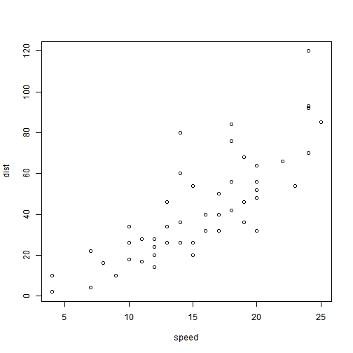

Effect of Income Inequality on Environment Performance Index (EPI)
========================================================
author: Mario Alonso Rodriguez and Raju Adhikari
date: 29 November 2016
autosize: true

Table of Contents
========================================================

- Research Question
- Theoretical Basis
- Operationalization
- Plots, Maps and other Descriptive Statistics
- Regression and Other Inferential Statistics
- Conclusion

Research Question
========================================================


Unrefined Question:


- Does income inequality have an effect on the environment ?

Refined Question:

- Does income inequality of a country affect its Environment Performance Index? If so, How?

Theoritical Premise
========================================================

- Carbon emission and equal countries
- Economic Development and unequal countries
- Environment Performance Index


Slide With Code
========================================================


```r
summary(cars)
```

```
     speed           dist       
 Min.   : 4.0   Min.   :  2.00  
 1st Qu.:12.0   1st Qu.: 26.00  
 Median :15.0   Median : 36.00  
 Mean   :15.4   Mean   : 42.98  
 3rd Qu.:19.0   3rd Qu.: 56.00  
 Max.   :25.0   Max.   :120.00  
```

Slide With Plot
========================================================


